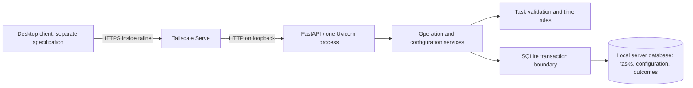

# Persistent Task Creation and Editing Design

**Spec:** [Approved delivery 1A specification](spec.md).

**Status:** Approved on 2026-09-13, baseline and audit revision together. The user explicitly approved TIME-02/03 in [context.md](context.md), then approved this Design and the formal [tasks](tasks.md). Prior stack decisions remain active. Execute is authorized for local implementation and local commits; deployment, real-host and real-database changes remain separately authorized.

**Boundary:** Creation and editing of pending tasks, fixed product time, server persistence, uniqueness, and original operation outcomes. No lifecycle commands from 1B, desktop implementation, metrics, or deadline-emphasis presentation are added.

## Architecture Overview

Use one Python application on the dedicated Ubuntu server. FastAPI exposes a versioned JSON request/response API; the application applies business rules and uses SQLite on local server storage. The desktop accesses the API through the existing private Tailscale relationship.

The user chose this architecture over FastAPI with a separate PostgreSQL service. SQLite reduces operational components for a personal collection, at the cost of serializing writes. Shared decisions are recorded in [STATE.md](../../STATE.md). The Ubuntu server target was supplied by the user; its release image is available from [Ubuntu](https://releases.ubuntu.com/releases/26.04.1/).



The baseline process supervisor, API, SQLite settings and dependencies remain approved, and the audit amendments below are approved with them. That approval covers local implementation; it does not authorize real-host or database changes.

### Architecture alternatives considered

| Approach | Outcome | Trade-off |
| --- | --- | --- |
| FastAPI with SQLite in the application server | Approved by the user. | One database writer at a time; short transactions and explicit lock handling are necessary. |
| FastAPI with a separate PostgreSQL service | Not selected. | Greater write concurrency adds a separately operated database service for the same feature scope. |

SQLite explicitly supports this application-server arrangement and documents its single-writer model. [SQLite deployment guidance](https://www.sqlite.org/whentouse.html).

## Code Reuse Analysis

There is no application code, configured application test suite, database schema, or deployment configuration to reuse. The existing source/test directories are empty. Reuse the approved product rules and scenario inputs, the current top-level layout, the requirement IDs, and the installed TLC validators. No confirmed lessons were returned by the skill script.

| Existing asset | Reuse |
| --- | --- |
| [spec.md](spec.md) | All 52 PCE criteria and their original REQ mappings, including the criteria added for explicit user clarifications; no implementation-derived expected outcomes. |
| [Product requirements](../../../docs/product/requirements.md) | Exact field boundaries, title examples, uniqueness populations, fixed-zone rules, and retry semantics. |
| [AGENTS.md](../../../AGENTS.md) | Python conventions, logging, database authorization, isolated tests, and verification gates. |
| `src/task-analyzer-server/`, `tests/`, `docs/architecture/` | Preserve these top-level locations; propose only the contents listed below. |

### Integration points

| Consumer | Stable input from this design |
| --- | --- |
| Delivery 1B | Task identity, transactional operation runner, outcome ledger, title comparison, configuration, and UTC clock. It adds its own commands only after its specification/design approvals. |
| Deadline analysis | Stored deadline date, fixed IANA product-zone key, server date, and cutoff conversion. No emphasis enum is exposed by 1A. |
| Productivity analysis | Original creation timestamp and current task visibility/status. Latest completion updates remain 1B work. |
| Desktop | JSON API, fixed-zone setup, operation ID rules, durable results, and separate current-state reads. The 15-second presentation timer remains desktop-owned. |

## Components

All locations below are proposed future files, not files created by this Design work. No general repository abstraction, ORM, message broker, or background job queue is needed for this delivery.

Package root: `src/task-analyzer-server/task_analyzer_server/`.

| Module | Responsibility | Proposed interface | Dependencies / reuse |
| --- | --- | --- | --- |
| `app.py` | Compose the app and verify startup configuration. | `create_app(settings: ServerSettings, clock: Clock) -> FastAPI`; `application_factory() -> FastAPI` | API, services, settings; injectable clock for tests. |
| `api.py` | Parse HTTP envelopes, call services, and map stored/transport results. | FastAPI routes in the API table below. | Contracts and services; no task mutation logic. |
| `contracts.py` | Request and response models with explicit serialization. | `TaskInput`, `ValidationIssue`, `TaskSnapshot`, `OperationResult`, `ProtocolError`, `ConfigurationView` | Pydantic and immutable issue values; never imports domain or services. |
| `domain.py` | Validate task fields and derive title comparison keys. | `validate_task(data: TaskInput) -> tuple[ValidationIssue, ...]`; `title_key(title: str) -> str` | Contract input/issue types and regex grapheme segmentation. Dependency is one-way from domain to contracts; structural and business validation remain distinct. |
| `clock.py` | Supply UTC time, product date, and deadline cutoff conversion. | `Clock.now() -> datetime`; `deadline_cutoff(deadline: date, zone: ZoneInfo) -> datetime` | Standard `datetime` and `zoneinfo`; approved exceptional-midnight rule. |
| `services.py` | Apply creation/editing and fixed-zone setup as transactions. | `apply_operation(request: OperationRequest) -> OperationResult`; `configure_zone(zone_key: str) -> ConfigurationView`; `lookup_operation(operation_id: UUID) -> OperationResult \| None` | Storage, domain, clock. Shared runner is reusable by 1B. |
| `storage.py` | Own connections, SQL statements, transaction completion, and reads. | `read_operation(operation_id: UUID) -> OperationResult \| None`; `read_tasks() -> tuple[TaskSnapshot, ...]` | Standard `sqlite3`; parameterized SQL only. |
| `settings.py` | Validate explicit runtime configuration. | `ServerSettings` | Standard environment/path handling. No default to a developer or production database during tests. |
| `logging_config.py` | Format standard logging records as JSON lines. | `configure_logging(level: str) -> None` | Standard `logging` and `json`. |
| `schema.py`, `schema/001_initial.sql` | Provide an explicit initialization entry point and versioned initial schema. | `initialize_database(path: Path) -> None` | Standard sqlite3 and importlib.resources directly; no dependency on operational storage helpers. Execution on real databases needs separate authorization. |

`OperationRequest` binds an operation UUID, method, canonical target path, and parsed JSON payload. `Clock` is the only service dependency needing a substitutable time source; storage tests use real disposable SQLite files. These are interface contracts, not implementation stubs. Define TaskInput and ValidationIssue before validate_task; contracts never import that validator. The schema initializer reads packaged SQL independently of operational storage. Deliver app.py and api.py together as one HTTP boundary with operation lookup and error handlers, so every later route can be verified through the composed application immediately.

### Proposed supporting locations

| Location | Purpose |
| --- | --- |
| `pyproject.toml` | Server package discovery, Python baseline, direct dependencies, and tool configuration. No client tool configuration. Explicit package data includes `task_analyzer_server = ["schema/*.sql"]`. |
| `requirements/server.in`, `requirements/dev.in`, generated lock files under `requirements/` | Reproducible dependency inputs and environment-specific, hash-pinned resolutions. |
| `tests/server/unit/` | Field validation, title comparison, time rules, and wire serialization. |
| `tests/server/integration/` | API outcomes, SQLite constraints, durability, restarts, and overlapping requests. |
| `docs/architecture/deployment/task-analyzer-server.service` | Proposed systemd service asset. |
| `docs/architecture/deployment/server.md` | Installation, explicit database initialization, private access, and verification instructions. |

These additions are covered by the Design approval; they are created only through approved tasks. No directories or scaffolds are created by this document. The existing `docker/` directory does not select container deployment.

## Data Models

One local SQLite database holds both task state and durable operation outcomes. The application opens it by an explicit absolute path. Proposed deployment path: `/var/lib/task-analyzer/task-analyzer.sqlite3`.

| Record | Fields and constraints |
| --- | --- |
| `product_configuration` | Singleton key `1`; non-null `product_time_zone` containing a validated IANA key. No configured-zone update operation in the MVP. |
| `tasks` | `task_id` UUID text primary key; submitted `title` text; derived `title_key` text; nullable observations; nullable `deadline_date` text; status restricted to `pending`/`completed`; original creation as integer UTC microseconds; nullable latest completion as integer UTC microseconds; `is_deleted` restricted to `0`/`1`. |
| `operation_results` | `operation_id` UUID text primary key; canonical request text; terminal outcome `succeeded`/`rejected`; original HTTP status; immutable serialized result; server-recorded resolution timestamp. |
| `schema_version` | Singleton version integer identifying the installed schema. It is distinct from product configuration. |

1A writes new tasks as pending, with no completion timestamp and `is_deleted=0`. Completed/deleted fields allow faithful comparison fixtures and a common eligibility definition. No completion, reopening, deletion, retention, or restoration command is implemented in 1A. 1B decides how its deletion command manages excluded rows; operation-result preservation cannot depend on the continued existence of a task row. Managed-task reads and future calculations must exclude `is_deleted=1` rows.

The operation ledger has no cascading task foreign key. Retain original results without a TTL in the MVP so a late repetition cannot become a new operation after expiry. This is internal result retention, not a user-facing audit/history or restore feature. A result snapshot is evidence of a past operation and is never merged into current task reads or metrics.

### Text bounds and comparison

Implement user-perceived character counting with default extended grapheme clusters under Unicode UAX #29. Propose the `regex` package's `\X` segmentation and pin its version with the application. Python `len`, SQLite `length`, Pydantic string `max_length`, and UTF-8 byte length do not implement the approved visual-character rule. [Unicode text segmentation](https://www.unicode.org/reports/tr29/), [regex grapheme support](https://pypi.org/project/regex/#matching-a-single-grapheme-x).

Count the title after trimming leading/trailing spaces; count observations as supplied, preserving line breaks. An empty or entirely whitespace title is rejected independently of the limit. Stop counting after the applicable limit is exceeded; do not truncate accepted input. Grapheme segmentation is independent of font rendering and does not merge arbitrary typographic ligatures. A base letter plus combining marks and a supported joined emoji sequence each count as one cluster. Test 200/201 title clusters and 5,000/5,001 observation clusters using both original simple-text cases and combined characters.

Keep submitted text separate from its comparison key. For the key, trim edge spaces, collapse internal space runs, and apply Unicode case folding while retaining accents. Propose U+0020 as the comparison space, matching the existing examples; reject whitespace-only titles using Unicode whitespace recognition. Do not strip accents, apply compatibility normalization, or collapse interior tabs/newlines into spaces. Comparison-key generation is centralized and identical for checks and stored keys; no database collation substitutes its own normalization. Any additional equivalence rule needs explicit approval.

### Uniqueness constraints

Create two unique partial indexes, using the precomputed application title key with binary equality:

- Dated tasks: unique `(title_key, deadline_date)` where `is_deleted=0` and `deadline_date IS NOT NULL`, irrespective of pending/completed status.
- Undated tasks: unique `title_key` where `is_deleted=0`, `deadline_date IS NULL`, and `status='pending'`.

The service checks for a conflicting row while holding the write transaction, excluding the edited task ID. The indexes enforce the same combinations if a competing write reaches storage. SQLite supports uniqueness on a selected subset of rows through [unique partial indexes](https://www.sqlite.org/partialindex.html#unique_partial_indexes).

Do not rely on SQLite's default case comparison to implement the product rule. TXT-01 is resolved by the approved grapheme-counting and comparison rules above. Store submitted text independently of its comparison key; internal-space normalization is for comparison, not an instruction to rewrite observations or display text.

### SQLite connection and durability policy

Proposed settings: `journal_mode=DELETE`, `synchronous=EXTRA`, `foreign_keys=ON`, and a 5,000 ms lock wait. Verify effective settings; a misspelled PRAGMA must not silently weaken durability. The database and rollback journal remain on the same local filesystem. `EXTRA` adds directory synchronization for DELETE journal commits. [SQLite PRAGMA documentation](https://www.sqlite.org/pragma.html#pragma_synchronous).

Use short explicit `BEGIN IMMEDIATE` transactions. Open, use, and close each connection within the same synchronous worker call, with Python's thread check enabled. No shared global connection or transaction spanning HTTP response streaming. Use explicit SQL transaction control rather than depending on Python-version-specific defaults; the Python 3.13 baseline supports `isolation_level=None`. [Python sqlite3 transaction control](https://docs.python.org/3.13/library/sqlite3.html#transaction-control).

FastAPI's synchronous path functions can run blocking work in a worker thread. Keep connection ownership in the service invocation, rather than opening it in a dependency that might run on a different thread. [FastAPI execution model](https://fastapi.tiangolo.com/async/#path-operation-functions).

Startup opens the configured database in existing-file mode, checks schema/settings and readable configuration, and fails visibly on an absent/incompatible database. It does not initialize, migrate, or recreate a database automatically. A new, intentionally initialized database can have an unset product zone; its configuration endpoints remain usable.

## Operation Consistency and Recovery

For a request with a valid operation envelope:

1. Parse the operation ID, target, and JSON syntax. Build a deterministic canonical request representation; object-key order and JSON whitespace do not change identity, but field values and the target do.
2. Acquire `BEGIN IMMEDIATE` before checking the operation ledger or task uniqueness.
3. If the operation ID already exists with the same canonical request, return the stored result after ending the read of that transaction. Do not validate or apply the command again.
4. If that ID exists with a different canonical request, return a protocol conflict. Preserve the original ledger entry and all task data.
5. For a new attempt, validate the payload and applicable task state, configuration, and uniqueness. A business rejection stores its terminal result without changing any task.
6. For an accepted command, apply the mutation and store its success snapshot in the same transaction. Sample creation time from the server clock when applying creation after write access has been acquired.
7. Commit before producing a terminal success/rejection response. Any unexpected storage error ends the transaction without returning an uncommitted terminal outcome.

The implementation must not use `executescript()` in an operation transaction because of its transaction-control behavior. On unexpected errors, explicitly roll back if a transaction is still active and close the connection. A failed commit must not be translated into successful persistence. [Python transaction documentation](https://docs.python.org/3.13/library/sqlite3.html#transaction-control), [SQLite transactions and errors](https://www.sqlite.org/lang_transaction.html).

```mermaid
sequenceDiagram
    participant D as Desktop
    participant A as API
    participant S as SQLite
    D->>A: Create/edit with operation ID
    A->>S: Begin immediate; check original outcome
    A->>S: Persist task change + success result, or rejection result
    A->>S: Commit
    A--xD: Response lost
    D->>A: Consult original operation ID
    A->>S: Read committed result
    A-->>D: Original outcome; no mutation
```

| Failure/concurrency case | Required handling |
| --- | --- |
| Process stops before commit | Transaction recovery leaves no committed partial task/outcome pair. Repetition with the same ID can safely establish the result. |
| Process stops after commit but before response | The committed outcome is found after restart; the original operation is not applied again. |
| Two simultaneous copies of one attempt | SQLite write serialization makes the second observe the first terminal result or become the only committed application if the first rolled back. |
| Two distinct operations conflict under uniqueness | At most one conflicting resulting state is accepted. A different operation is never treated as a replay just because its title matches. |
| Old edit is retried after a later accepted edit | Return the old result snapshot; do not overwrite the later task state. The desktop refreshes current state separately. |
| Original rejection's conflict later disappears | Consult/replay the original rejection. A corrected or deliberately new action uses a new operation ID. |
| Result lookup sees no committed row while work is in flight | Return unknown, not cancelled or rejected. A safe repetition still uses the same ID and is serialized with the original attempt. |
| Lock wait, disk-full, I/O error, or failed commit | Return an infrastructure error if possible; no invented terminal result. The client consults the original ID. A lock timeout is not the desktop's 15-second product timer. |

No durable `pending` ledger row or separate worker is necessary: writes and terminal outcomes share one transaction. A missing row cannot distinguish not-yet-received, in-flight, and rolled-back work, so the API explicitly preserves that uncertainty. SQLite documents the lock behavior of [BEGIN IMMEDIATE](https://www.sqlite.org/lang_transaction.html#deferred_immediate_and_exclusive_transactions).

## API and Desktop Contract

Propose HTTPS/JSON request/response with `/v1` routes. No WebSocket or push channel is needed for 1A. FastAPI's OpenAPI output describes the wire contract; it is not a second source of business rules. [FastAPI features](https://fastapi.tiangolo.com/features/).

### Routes

| Method and path | Input | Result |
| --- | --- | --- |
| `GET /v1/configuration` | None. | `200` with configured flag, retained zone or null, server UTC time, and current product date or null. |
| `PUT /v1/configuration` | `product_time_zone`: IANA zone key. | First valid setup persists the zone; repeated setup with the same key returns the same configuration. A different key returns `409 PRODUCT_TIME_ZONE_FIXED` without replacing it. Invalid/unknown zone returns `422 INVALID_TIME_ZONE`. |
| `GET /v1/tasks` | None. | `200` with all non-deleted tasks and server time/product-zone metadata. No product sorting, filtering, pagination, or metrics feature is introduced. |
| `POST /v1/tasks` | `Operation-Id` header plus task input. | Durable operation result; `201` on created task. |
| `PUT /v1/tasks/{task_id}` | `Operation-Id` header plus full editable task input. | Durable operation result; `200` on accepted pending-task edit. Missing task gives a stored rejection; completed-task editing remains outside the 1A command contract. |
| `GET /v1/operations/{operation_id}` | Original operation UUID. | `200` with its stored outcome, or `404 OPERATION_RESULT_UNKNOWN` when no committed result can be established. |

`PUT` replaces the editable fields as one save: required title, optional observations, optional deadline. Omitted optional values mean absent; clients send the entire form state. `null` clears an optional value. Input status, creation time, and other server-owned fields are rejected rather than silently applied. This is a proposed wire representation of Save, not a change to its desktop trigger.

Configuration setup is itself an atomic compare-and-set on the singleton. The same configured key is safe to repeat without an operation ledger; a new configuration cannot overwrite an existing one. Before setup, task commands return a protocol-level `409 PRODUCT_TIME_ZONE_REQUIRED` without recording a terminal task result. The desktop completes setup before enabling task operations.

### Values and responses

- Task input: `title` string; `observations` string or null; `deadline` calendar-date string or null. Reject type coercion, unknown fields, invalid JSON numbers, and non-calendar dates. Enforce approved visual-character limits through grapheme segmentation. Preserve observations and line breaks.
- Task identity: server-generated UUID, serialized as canonical lowercase hyphenated text. An edit targets the existing UUID; titles are never identities.
- Operation identity: client-generated UUID for one submitted action, kept in the open desktop session for consultation/repetition. The protocol does not require persistent local drafts or automatic resubmission after desktop restart.
- Operation result: `operation_id`, terminal `outcome`, `original_http_status`, either `task` snapshot or `error`, and `resolved_at`. `error` contains a stable code and field details; uniqueness errors include the conflicting task identity. The desktop owns user-facing wording.
- Direct replay returns the original HTTP status and stored result. Lookup returns HTTP 200 for either stored terminal outcome; consumers inspect `outcome` and must not interpret lookup's HTTP 200 as successful task persistence.
- Protocol/infrastructure errors carry an error code and request ID but do not masquerade as durable `OperationResult` values. Unknown lookup is similarly distinct from a stored rejection.
- Successful task snapshots include identity, title, observations, deadline, status, and original creation time. They deliberately omit dynamic emphasis/metrics. Current task reads are separate from immutable operation snapshots.
- Reads use a fresh committed snapshot and `Cache-Control: no-store`. Within one task-list response, use one sampled server time and retained product zone. Array order is not a product guarantee.

Canonical requests include API version, method, canonical task target, and parsed JSON values before business normalization. A corrected title or changed deadline changes the request. Store the canonical representation itself so equality does not rely only on a hash. Invalid task payloads with a valid operation envelope are validated inside the operation flow so their rejection can be retained. Unparseable JSON or an unusable operation ID is a protocol error outside that flow.

### Response shapes

| Model | Exact public fields |
| --- | --- |
| `TaskSnapshot` | `task_id`, `title`, `observations` (nullable string), `deadline` (nullable calendar date), `status`, `created_at` (UTC instant), `completed_at` (nullable UTC instant). 1A-created tasks have `status=pending` and `completed_at=null`. Internal comparison/deletion fields are not exposed. |
| `ConfigurationView` | `configured` boolean, `product_time_zone` nullable IANA key, `server_now` UTC instant, `product_date` nullable calendar date. |
| Task-list response | `items` array of TaskSnapshot plus `product_time_zone`, `server_now`, and `product_date`. The array is empty for an empty collection. |
| `OperationResult` | `operation_id`, `outcome`, `original_http_status`, `task` nullable TaskSnapshot, `error` nullable OperationError, `resolved_at` UTC instant. Exactly one of `task` and `error` is non-null. |
| `OperationError` | `code` stable string, `fields` array of `{field, code}` issues (empty for a non-field error), `conflicting_task_id` nullable UUID. |
| `ProtocolError` | `request_id` (nonempty server-generated UUID text for this HTTP request), `error` containing `code` and `fields`, plus `operation_id` only when a usable ID was supplied. No terminal `outcome` is present. The same request_id appears in the corresponding log record; it is not the operation ID or a field of the immutable OperationResult. |

Field-error codes include `TITLE_REQUIRED`, `TITLE_TOO_LONG`, `OBSERVATIONS_TOO_LONG`, `INVALID_DEADLINE`, `INVALID_FIELD_TYPE`, and `UNEXPECTED_FIELD`. The application translates framework errors into these stable codes; framework-specific error objects and echoed input are not the desktop contract. Prepare and validate the terminal JSON representation inside the transaction before storing it, then send that stored representation after commit.

An example persisted creation result (also returned by consultation, whose HTTP status is 200):

```json
{
  "operation_id": "10000000-0000-4000-8000-000000000001",
  "outcome": "succeeded",
  "original_http_status": 201,
  "task": {
    "task_id": "20000000-0000-4000-8000-000000000001",
    "title": "Read notes",
    "observations": null,
    "deadline": "2026-09-14",
    "status": "pending",
    "created_at": "2026-09-13T12:00:00.000000Z",
    "completed_at": null
  },
  "error": null,
  "resolved_at": "2026-09-13T12:00:00.000000Z"
}
```

For rejection, `task` is null, `outcome` is `rejected`, and the stored original HTTP status matches the error table. Result consultation's transport status does not override that terminal outcome.

### Error Handling Strategy

| Case | HTTP / code | Task/result effect |
| --- | --- | --- |
| Invalid task fields | `422 TASK_VALIDATION_FAILED` | Durable rejection; task unchanged. Includes original 200/201 and 5,000/5,001 scenarios. |
| Uniqueness conflict | `409 TASK_UNIQUENESS_CONFLICT` | Durable rejection; both tasks unchanged. |
| Edit target absent or excluded from managed tasks | `404 TASK_NOT_FOUND` | Durable rejection; no creation through edit. |
| Target state outside the 1A pending-edit command | `409 TASK_STATE_INCOMPATIBLE` | Durable rejection; no state/time change. 1B separately adds approved completed-observation editing. |
| Operation ID reused with different content | `409 OPERATION_ID_REUSED` | Protocol error; original task/outcome unchanged. |
| Invalid operation envelope | `400 INVALID_OPERATION_ENVELOPE` | No terminal operation registered. |
| No committed result found | `404 OPERATION_RESULT_UNKNOWN` | No claim of rejection, cancellation, or rollback. |
| Temporary storage failure | `503 STORAGE_UNAVAILABLE` | No success confirmation; consult the original ID. |
| Unexpected server defect | `500 INTERNAL_ERROR` | Roll back active transaction, log details server-side, do not expose an invented persisted result. |

## Time Representation

Use aware UTC `datetime` values internally for instants and integer microseconds for SQLite timestamps. Serialize UTC instants with an explicit `Z` suffix and six fractional digits. Convert using integer/timedelta arithmetic, not floating-point epoch rounding. Use calendar `date` values and `YYYY-MM-DD` strings for deadlines. Accept `0001-01-01` through `9999-12-30`, inclusive, as approved during audit correction. Reject `9999-12-31` and all out-of-range values as `INVALID_DEADLINE`, inside the durable task-validation flow. No year-10000 sentinel or saturated cutoff is used.

Store the product's IANA zone key separately; use standard `zoneinfo.ZoneInfo` for conversion. Ubuntu provides system zone data; declare `tzdata` for Windows server-test environments where IANA data may be absent. Log the runtime/time-data versions used in validation. [Python zoneinfo data sources](https://docs.python.org/3/library/zoneinfo.html#data-sources).

For ordinary dates, form the next calendar date's local midnight, then convert it to UTC. Do not compute the cutoff as creation plus 24 hours or add 24 elapsed hours to the deadline's start: calendar days and elapsed durations differ around offset changes. The user approved using the first occurrence of a repeated midnight and the first valid instant at or after the nominal next-day boundary when midnight is absent, even if the whole following date is skipped.

Resolve the nominal midnight by constructing both fold candidates and round-tripping each through UTC. If valid candidates reproduce the nominal local time, choose the earliest UTC instant. If neither does, use the candidates to bracket the forward transition and find the first valid boundary at or after the nominal midnight, using integer-microsecond bisection on UTC instants. Validate that the returned local date/time is at or after the intended calendar boundary and that the immediately preceding UTC microsecond is before it. Do not require equality of the local calendar date: an entire skipped date advances the cutoff to the first instant after that date. Handle fold-candidate UTC overflow at the supported extremes before conversion; regression fixtures must cover the supported date endpoints and both offset directions. Do not merely add the offset difference to midnight: that can overshoot the first valid instant when a gap begins before midnight. [zoneinfo fold and conversion behavior](https://docs.python.org/3/library/zoneinfo.html#using-zoneinfo).

Expected transition-test instants must come from independently checked zone-transition data, not from calling the cutoff helper to generate expected values. Keep the ordinary September 14/15 scenario intact; add explicit repeated-midnight and missing-midnight fixtures under PCE-49/50. The skipped-date oracle is `2011-12-30T10:00:00.000000Z` for a `2011-12-29` deadline in `Pacific/Apia`, corresponding to `2011-12-31T00:00:00+14:00`; its source is the [IANA Australasia data](https://data.iana.org/time-zones/tzdb/australasia). Under PCE-51/52 test the accepted date endpoints and the rejected `9999-12-31` value on creation and editing.

The configured zone remains fixed even if the desktop's zone or the server host's display zone changes. Original creation is immutable. Completion timestamp writes remain 1B work. Zone-data updates and representable date boundaries require regression fixtures; a library default must not silently change the approved calendar interpretation or add a new user-facing deadline limit.

## Runtime, Private Access, and Logging

Use a Python virtual environment on Ubuntu Server 26.04.1 LTS, supervised by systemd, running one Uvicorn worker on `127.0.0.1:8000`. The revised runtime entry is `python -m uvicorn task_analyzer_server.app:application_factory --factory --host 127.0.0.1 --port 8000`. The zero-argument factory constructs ServerSettings and the default Clock, then calls the existing injectable create_app(settings, clock). Neither factory initializes a database. Use the standard asyncio loop and no development reload. Keep SQLite entirely on the server's local disk. Uvicorn supports explicit host/port/worker settings. [Uvicorn settings source](https://github.com/encode/uvicorn/blob/main/docs/settings.md).

Propose Tailscale Serve as the tailnet-only HTTPS reverse proxy to that loopback listener. Use a dedicated tailnet device name and access policy allowing the user's desktop to reach this service. The application has no product sign-in and does not treat forwarded identity headers as product accounts. Tailscale Serve's persistent background mode resumes after reboot. [Tailscale Serve](https://tailscale.com/docs/reference/tailscale-cli/serve).

The future service asset uses a dedicated unprivileged `task-analyzer` account, a writable state directory, a read-only installed application, and restart-on-failure supervision. Deployment instructions must separately establish the tailnet hostname, HTTPS availability, and authorized device access; no real host, credential, or tailnet rule is assumed to have been inspected or configured here. Ordinary local tests run without Tailscale; the private-access acceptance check remains a separate authorized environment check.

Proposed environment values: `TASK_ANALYZER_DATABASE_PATH` (required absolute path), `TASK_ANALYZER_LOG_LEVEL` (default INFO), and `TASK_ANALYZER_DB_BUSY_TIMEOUT_MS` (default 5000). The fixed product zone is persisted product configuration, not an environment override.

Structured logs use standard `logging` with JSON-line output: `timestamp`, `level`, `event`, `request_id`, optional `operation_id`/`task_id`, `outcome`, `error_code`, and `duration_ms`. Measure elapsed duration with a monotonic clock. Log runtime versions at startup. Do not log task titles, observations, complete request bodies, canonical requests, or secrets. Task success events occur only after commit; a lost network response does not turn a committed success into a business rejection. Log formatting must not determine whether a transaction commits.

## Dependencies and Quality Checks

| Item | Proposed choice / use | Approval state |
| --- | --- | --- |
| Runtime language | Python 3.13 minimum; validate both the minimum and the interpreter installed on the selected Ubuntu runtime. | Approved baseline; raised from 3.11 by the user on 2026-09-13. |
| API and database | FastAPI and SQLite. | Approved architecture. |
| Server host | Ubuntu Server 26.04.1 LTS. | User supplied and approved. |
| ASGI / data models | Uvicorn, Pydantic v2. Use Pydantic explicitly for strict wire models. | Approved 2026-09-13. |
| Time / persistence | Standard `datetime`, `zoneinfo`, `uuid`, `sqlite3`; `tzdata` for environments without system IANA data. | Approved 2026-09-13. |
| Visual character counting | `regex` extended grapheme cluster segmentation (`\X`). | Approved 2026-09-13. |
| Tests | pytest and HTTPX; real SQLite files for integration/restart/concurrency cases. | Approved 2026-09-13. |
| Formatting / lint / types | Ruff formatter/linter and mypy strict checking for the server. | Approved 2026-09-13. |
| Packaging / locking | Standard venv/pip, setuptools, build, and pip-tools. Pin exact compatible versions and hashes in per-environment lock files during the dependency task. | Approved 2026-09-13. |

FastAPI/Pydantic dependencies are resolved together; do not independently upgrade Starlette underneath the validated combination. Exact patch versions are not invented in this document. T2 includes setuptools in the locked development toolchain so wheel builds can use `--no-isolation` without resolving a different backend. T2 resolves and hash-locks the local Python 3.13 environment, recording its OS/architecture/interpreter in requirements/README.md. It does not claim that a Windows lock is valid on Ubuntu. Confirm the actual Ubuntu interpreter before producing/validating the target-specific lock, satisfying AD-003's host compatibility prerequisite. Target locks and the same gates on that environment remain a mandatory authorized-deployment checkpoint; local task completion cannot substitute for them. Any incompatible dependency requires a proposal revision rather than silently raising the Python minimum.

Use Ruff with a 79-character code limit, Google docstring convention, import ordering, and error/unused-code checks; mypy strict for server source. Exclude installed skill bundles from application lint/type targets. Test functions also use annotations and docstrings under AGENTS.md. [Ruff](https://docs.astral.sh/ruff/), [mypy](https://mypy.readthedocs.io/en/stable/getting_started.html), [Pydantic strict mode](https://pydantic.dev/docs/validation/latest/concepts/strict_mode/).

The task plan defines two initial bootstrap gates: T1 validates the TOML configuration and named settings; T2 installs the hash-locked environment and verifies tool invocations and dependency consistency. Neither claims missing application tests as passing. At Phase 1 completion, T3/T4 supply substantive source and tests, and the full gates below become mandatory. No nonzero exit, missing target or empty test collection is accepted as success.

Full gates, from the repository root after that foundation exists:

| Gate | Command / evidence |
| --- | --- |
| Requirement/regression tests | `python -m pytest tests/server` |
| Lint | `python -m ruff check src/task-analyzer-server tests/server` |
| Formatting | `python -m ruff format --check src/task-analyzer-server tests/server` |
| Types | `python -m mypy --strict src/task-analyzer-server/task_analyzer_server` |
| Build | `python -m build --no-isolation` using the locked build backend, and install/import the built wheel in an isolated environment. From T27, the test gate also initializes a disposable database and launches the runtime factory using only the installed wheel, outside the checkout. |
| Dependency consistency | `python -m pip check` in each locked environment. |
| Private deployment | Service startup/restart, configuration retention, and access from an authorized desktop through Tailscale. The user confirmed on 2026-09-13 that this runs on their own Ubuntu server: no disposable validation host is used, so every step needs explicit deployment authorization when it is performed, and the first database initialization is authorized separately from the deployment itself. |

These gates are planned, not run during Design. [PyPA build](https://build.pypa.io/en/stable/) and [pip-tools](https://pip-tools.readthedocs.io/en/stable/) provide the proposed packaging/locking tools. CI should run the same commands in disposable environments; selection of a hosted CI provider and connecting the repository are separate deployment/tooling decisions, not necessary to define the local gates.

## Test and Requirement Coverage

Tests use a newly allocated temporary directory and a clearly identified disposable database. They cannot fall back to the runtime database path. Restart tests launch a new process against that same test database. Concurrency tests use independent connections and explicit synchronization instead of sleeps. The approved numeric/title/date examples stay unchanged. [pytest temporary directories](https://docs.pytest.org/en/stable/how-to/tmp_path.html).

| Planned test area | PCE coverage | Product traceability | Important outcome |
| --- | --- | --- | --- |
| Field validation / API validation | PCE-01 through PCE-10, PCE-15, PCE-16, PCE-48, PCE-51, PCE-52 | REQ-007, REQ-008, REQ-010, REQ-011 | Exact bounds, optional fields, multiline text, past/invalid dates; invalid edits preserve the whole task. Include combined-character/emoji fixtures under the approved TXT-01 rule. |
| Pending edits | PCE-11 through PCE-16 | REQ-007, REQ-008, REQ-010, REQ-028, REQ-029 | Stable identity/creation time/status; full editable-state replacement and optional clearing. |
| Uniqueness / competing writes | PCE-17 through PCE-27 | REQ-008, REQ-029, REQ-031 | Full comparison populations and protected title examples; one conflicting result accepted at most. |
| Clock / configuration / cutoff | PCE-28 through PCE-33, PCE-35, PCE-49, PCE-50 | REQ-011, REQ-028 | Server clock, fixed zone, retained setup, approved September cutoff, and independently grounded exceptional-midnight fixtures. |
| Durability / fresh sessions | PCE-34 through PCE-36 | REQ-010, REQ-028 | Task changes and zone survive a new server process and client session. |
| Outcome ledger / fault injection | PCE-37 through PCE-43 | REQ-010, REQ-029, REQ-031 | Lost response, same-ID overlap, different-ID conflict, immutable rejection, old edit replay, before/after-commit crashes. |
| Runtime / access | PCE-44 through PCE-47 | REQ-003, REQ-027 | Minimum runtime and selected Ubuntu validation; private access with no product sign-in. |

T22 supplies composition, handlers and operation lookup in one self-testable HTTP boundary. T23-T26 exercise each new route's applicable error paths in the same task, including malformed-envelope, field-validation, conflict and infrastructure cases for task commands; T27 is an installed-distribution suite, not deferred protocol coverage. It asserts packaged SQL, disposable initialization, factory startup and persistence across restart without an editable-install or checkout fallback.

The Verifier may report successful local checks while the overall feature remains incomplete. An overall PASS, Verified traceability and validate_state completion require the actual target-interpreter and private-access evidence. T31 documents the pending externally authorized checkpoint; documentation alone cannot satisfy PCE-47.

Each concrete test records its REQ and PCE IDs. Tasks must map every criterion to exact test cases and per-task gates. Tests assert spec outcomes, not calls to internal methods. A restart/crash test does not substitute for a physical power-loss claim; durability also depends on filesystem/device synchronization semantics. The independent Verifier and discrimination sensor run after implementation, not as a placeholder Design report.

## Risks & Concerns

| Concern | Evidence location | Impact | Mitigation |
| --- | --- | --- | --- |
| No application tests or reusable implementation | `spec.md:233`; empty existing source/test directories | No regression baseline exists yet. | First formal tasks establish isolated tests and quality configuration before feature implementation is complete. |
| Persisted task without its operation result | `spec.md:161` and `spec.md:164` (REQ-010/031) | Lost response could lead to duplicate application. | One commit boundary for mutation and terminal result; crash and replay tests. |
| Uniqueness check separated from write | `spec.md:119` and `spec.md:127` | Concurrent operations could both accept a conflict. | Immediate transaction plus matching unique indexes and real concurrent-connection tests. |
| Unknown lookup mistaken for rejection | `spec.md:167` | Desktop could incorrectly report failure or start a different operation. | Distinct response type/code; same-ID repetition remains safe. |
| Character counting/comparison precision | `spec.md:88` (PCE-48) | Library defaults could change acceptance of Unicode input. | Use the approved visual-counting rule and pinned grapheme segmentation; preserve approved accent/space examples. |
| Midnight ambiguity or gap | `spec.md:148` and `spec.md:149` (PCE-49/50) | A library default could choose an unapproved cutoff. | Implement the approved first-occurrence/first-valid-instant rule and verify independent date-transition fixtures. |
| SQLite locks and persistence settings | `spec.md:145` and `spec.md:161` | Lock contention or weak settings could undermine reliable results. | Short transactions, bounded lock wait, verified PRAGMAs, local filesystem, and outcome lookup after infrastructure errors. |
| Stale operation snapshot mistaken for current state | `spec.md:169` | Replaying an old edit could display outdated task content as current. | Return immutable operation evidence and separately refresh current task state. |
| Detail approval mistaken for database/deployment authorization | `AGENTS.md:85` and `AGENTS.md:86` | An implementation workflow could apply changes to real data. | Explicit initializer and deployment steps; tests operate only on disposable paths. |

## Tech Decisions

| Decision | Choice | Rationale / status |
| --- | --- | --- |
| Server architecture | FastAPI + local SQLite on Ubuntu Server 26.04.1 LTS | Approved by user; shared architecture recorded as AD-001. |
| Communication | Versioned HTTP JSON commands, reads, and result lookup | Approved 2026-09-13; covers the approved operations without a persistent connection. |
| Persistence boundary | Task mutation and immutable terminal result in one SQLite transaction | Approved 2026-09-13; directly addresses lost responses and restart consistency. |
| Result lifetime | No expiry or automatic purge in the MVP | Approved 2026-09-13; avoids reapplying a late repeated attempt. |
| Database access | Standard sqlite3, explicit transactions, no ORM | Approved 2026-09-13; keeps transaction ownership visible for this small schema. |
| Deployment | Native virtual environment + systemd + Tailscale Serve | Approved 2026-09-13; uses the selected Ubuntu server and private-access mechanism. |
| Test/quality stack | pytest, HTTPX, Ruff, mypy, build, pip-tools | Approved 2026-09-13; approval names the intended additional tools before implementation. |

Only qualifying project-level decisions belong in the active decision log; [AD-002](../../STATE.md#ad-002) records the shared server contracts established here. The user's explicit visual-counting and exceptional-midnight decisions are now recorded in the approved behavioral inputs; library defaults do not replace those decisions.

## Open questions

- **Behavioral clarifications resolved:** TXT-01 uses user-perceived characters; TIME-01 uses the first repeated midnight or first valid instant when midnight is absent. TIME-02 extends this to an entirely skipped following date, and TIME-03 fixes the supported deadline range; both are explicitly approved in context.md. All original scenario examples and IDs remain; PCE-51/52 add the approved date-range checks.
- **Audit revision approved (2026-09-13):** the one-way input/domain dependency, standalone initializer, self-testable HTTP foundation, explicit request_id field, zero-argument runtime factory, packaged SQL smoke test and executable bootstrap gates are approved as part of this Design. The task plan is approved and its implementation tasks are authorized locally.
- **Deployment values:** The target is the user's own Ubuntu server (confirmed 2026-09-13). The actual tailnet hostname, device access identifiers, installed interpreter/version set, and host paths must still be supplied by the user before deployment. Because validation happens on the real host rather than a disposable one, no step is performed until the user authorizes that specific step, and existing state is backed up before the first database initialization. Local work through the end of the task plan does not touch that host.
- **Later features:** Windows client technology, its Windows-to-IANA zone mapping, visual refresh scheduling, and 1B's transition/deletion implementation remain with their respective designs.
