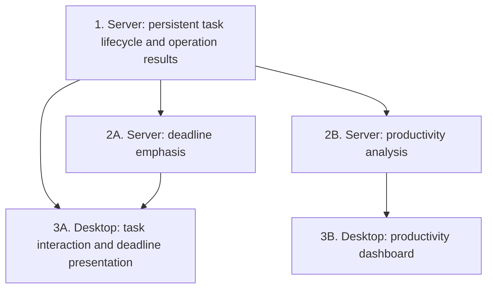

# MVP map

This document maps MVP capabilities to responsible components, dependencies, and a suggested order for future feature specifications. [Scope](scope.md) defines the product boundary, and [Requirements](requirements.md) defines the behavior and acceptance scenarios.

## Starting point

Begin with the Task Analyzer Server's persistent task lifecycle. The product rules for access, time, uniqueness, operation outcomes, deadline analysis, and desktop interaction are defined in the requirements and ready for feature specification work.

Follow the [development workflow](../../AGENTS.md#source-of-truth-and-workflow): approve the behavioral specification, then resolve its technical choices and contracts in the design before planning and implementation. Establish shared decisions in the first relevant design and reuse them across dependent features.

The map describes capability dependencies, not an implementation plan or a deployment topology. It does not assign new specification folder names or change the repository layout.

## Suggested capability order

| Order | Capability | Responsible component | Requirement coverage | Contracts that must be stable |
| --- | --- | --- | --- | --- |
| 1 | Persistent task lifecycle and operation results | Task Analyzer Server | REQ-003, REQ-007 through REQ-011, REQ-027 through REQ-029, REQ-031 | Task validation and identity; allowed transitions; server time and fixed product zone; persistence confirmation; uniqueness enforcement; recognition and result lookup for repeated attempts. |
| 2A | Deadline emphasis | Task Analyzer Server | REQ-026, REQ-034 | Group 1's task state, product date, and deadline cutoff; the emphasis result and its availability for the required refresh timing. |
| 2B | Productivity analysis | Task Analyzer Server | REQ-021 through REQ-025, REQ-033 | Group 1's original creation/latest completion times, task status, deletion treatment, and deadline cutoff; metric populations, calculation results, and values needed by the charts. |
| 3A | Task interaction and deadline presentation | Desktop App | REQ-001, REQ-007 through REQ-011, REQ-026 through REQ-032, REQ-034, REQ-035 | Groups 1 and 2A's approved operation and deadline-result contracts; initial time-zone configuration; shared connection feedback, temporary-input behavior, and Windows validation baseline. |
| 3B | Productivity dashboard | Desktop App | REQ-001, REQ-021 through REQ-025, REQ-031 through REQ-035 | Group 2B's metric-result contract; shared connection and refresh behavior; numerical presentation, chart interaction, and Windows validation baseline. |

Every MVP requirement appears in the map. A requirement can span a server rule and its desktop presentation without giving the desktop ownership of the calculation.

## Dependency overview

Arrows indicate prerequisite contracts, not a requirement to finish implementation before writing a dependent specification.

## Parallel work

- **Server capabilities:** deadline emphasis and productivity analysis can be specified in parallel after the core lifecycle, time-reference, and cutoff contracts are stable. Metrics depend on deadline semantics, not on the implementation of emphasis.
- **Server and desktop:** a desktop specification can proceed while the corresponding server work continues once the approved behavioral contract describes the inputs, results, and failures it must present. Dependent implementation additionally requires an approved technical communication contract.
- **Desktop capabilities:** task interaction and dashboard specifications can progress in parallel once their server contracts and shared connection, refresh, and presentation conventions are stable.
- **Acceptance coverage:** map each specification's approved criteria to its requirement tests and review that coverage alongside specification work. Integrated verification requires compatible components and follows the [MVP completion criterion](scope.md#completion-criterion).

Contract changes follow the existing approval workflow and must be reflected in affected specifications and acceptance coverage. Broader desktop work and every other [Backlog](backlog.md) capability remain outside this sequence.

## Open questions

No unresolved MVP product decisions block the first feature specification. Technical choices and detailed contracts are owned by [AGENTS.md](../../AGENTS.md#open-questions) and resolved in the relevant design.
