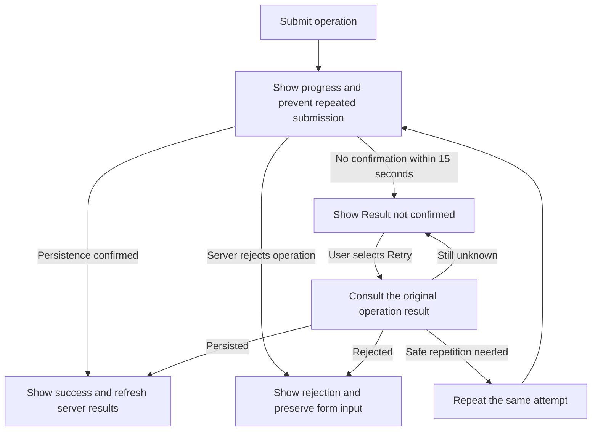

# User flows

These flows describe the user-facing sequences of the MVP. [Requirements](requirements.md) defines the rules and acceptance scenarios; [Scope](scope.md) defines component responsibilities and boundaries.

## 1. Open the desktop and access tasks

1. The user opens the Desktop App, which connects to the personal server through the private access arrangement.
2. During initial configuration, the product time zone is obtained from the desktop and retained by the server.
3. The desktop loads persisted tasks and server-derived results.
4. If the server is unavailable, the desktop shows the connection problem and Retry, with task operations unavailable until communication is established.

Requirements: REQ-001, REQ-003, REQ-027, REQ-028, REQ-032.

## 2. Create or edit a task

1. The user opens a task form and supplies or changes its title, observations, and optional deadline.
2. The user selects Save.
3. The desktop sends the operation and shows progress while preventing repeated submission.
4. The server validates the task and its resulting uniqueness combination, then either rejects the operation or persists it.
5. The desktop presents the confirmed result and refreshes the affected views. Rejection leaves the entered text available for correction.

Requirements: REQ-007, REQ-008, REQ-010, REQ-011, REQ-029 through REQ-032, REQ-034.

## 3. Complete, annotate, reopen, or delete a task

1. Selecting Complete or Reopen immediately submits the corresponding operation.
2. The server validates the resulting state, including uniqueness on reopening, before applying the change.
3. A completed task's observations can be edited and saved. Changing its title or deadline requires successful reopening first.
4. Selecting Delete opens confirmation identifying the task and warning about permanent deletion. Confirming immediately submits deletion; no additional Save action is required.
5. The desktop shows success only after server confirmation, then presents the updated task state, emphasis, and metrics.

Requirements: REQ-008, REQ-009, REQ-025, REQ-026, REQ-029 through REQ-031, REQ-034. Detailed lifecycle effects and the reopening-conflict example are defined in [Requirements](requirements.md#task-uniqueness).

## 4. Review deadlines and productivity

1. The task view presents the deadline emphasis supplied by the server. Completed tasks have a neutral presentation and retain their deadline date when present.
2. The user opens the dedicated metrics area to see counts, completion indicators, and the two charts.
3. Hovering over chart elements shows values and explanations.
4. Opening or returning to these views requests current results. Confirmed operations and product-date changes also trigger refresh under the required timing.

Requirements: REQ-021 through REQ-026, REQ-033, REQ-034. [Metric presentation](requirements.md#metric-presentation) defines the chart populations and numerical formats.

## 5. Handle an unconfirmed operation

The desktop distinguishes a server rejection from the absence of a confirmed result. The sequence follows REQ-031:

The server recognizes repeated attempts so an operation is not applied twice. A timeout does not cancel a server operation. Form input remains available while its window stays open, under REQ-032. The attempt-recognition and result-query mechanisms are technical design decisions.

## 6. Leave a form or close the desktop

1. If there are unsent changes, closing the form or application displays a warning that the input will be lost and requests discard confirmation.
2. Cancelling keeps the form and its input open.
3. Confirming discards those unsent changes and closes without submitting them.
4. When the desktop is started again, it loads server-persisted state and does not resend previous drafts automatically.

Requirement: REQ-032.

## Open questions

No unresolved MVP interaction decisions remain. Technical decisions for these flows belong in the relevant designs and are tracked in [AGENTS.md](../../AGENTS.md#open-questions).
